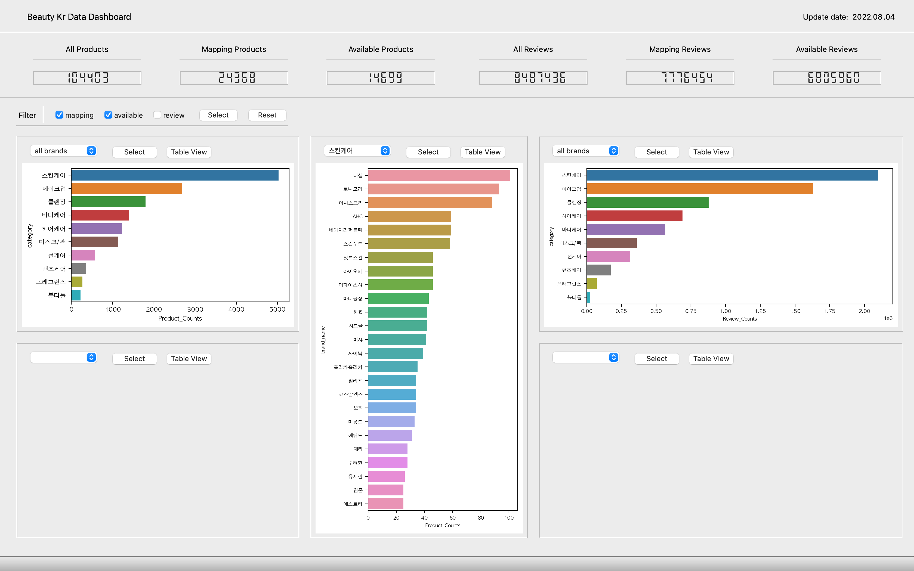
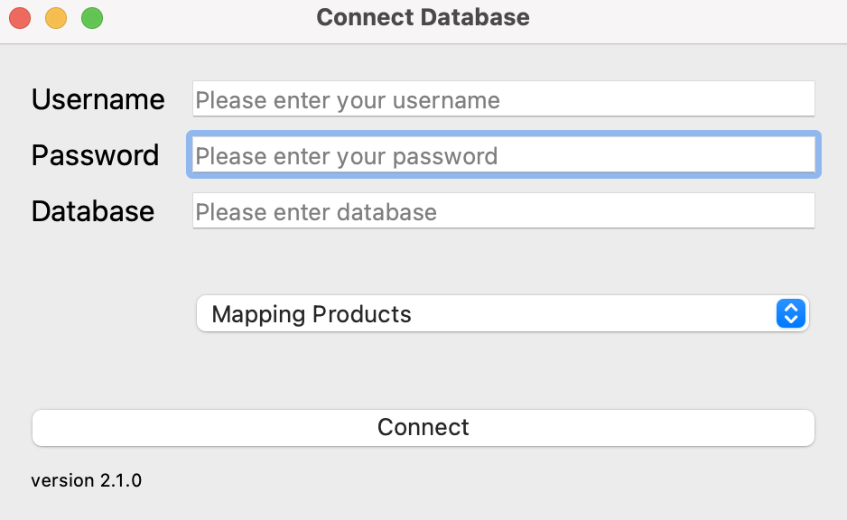
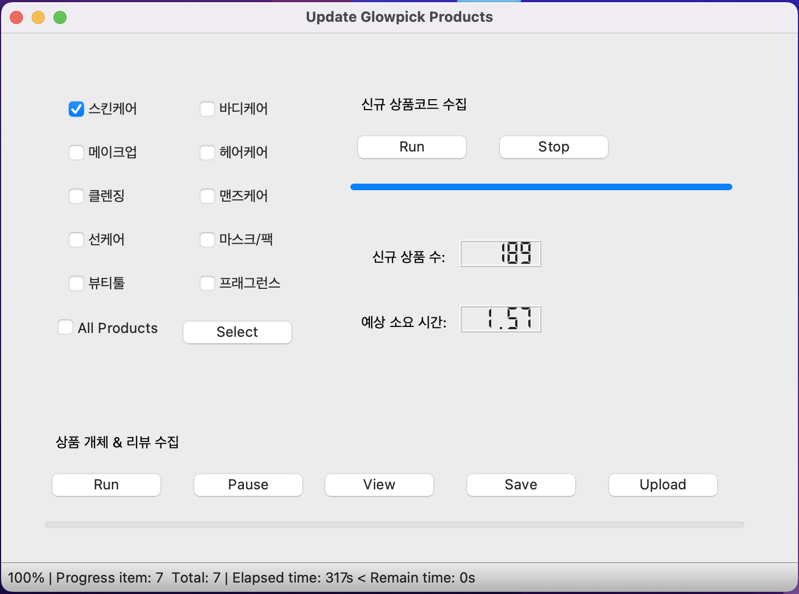
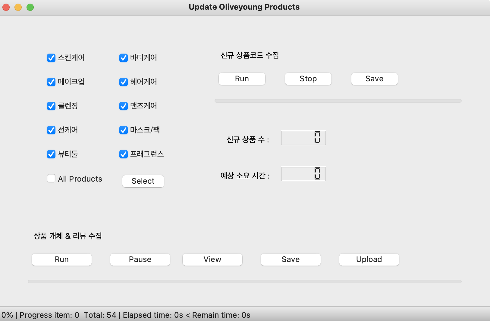
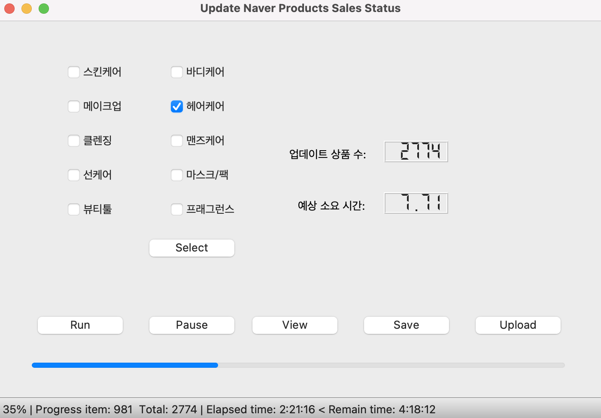
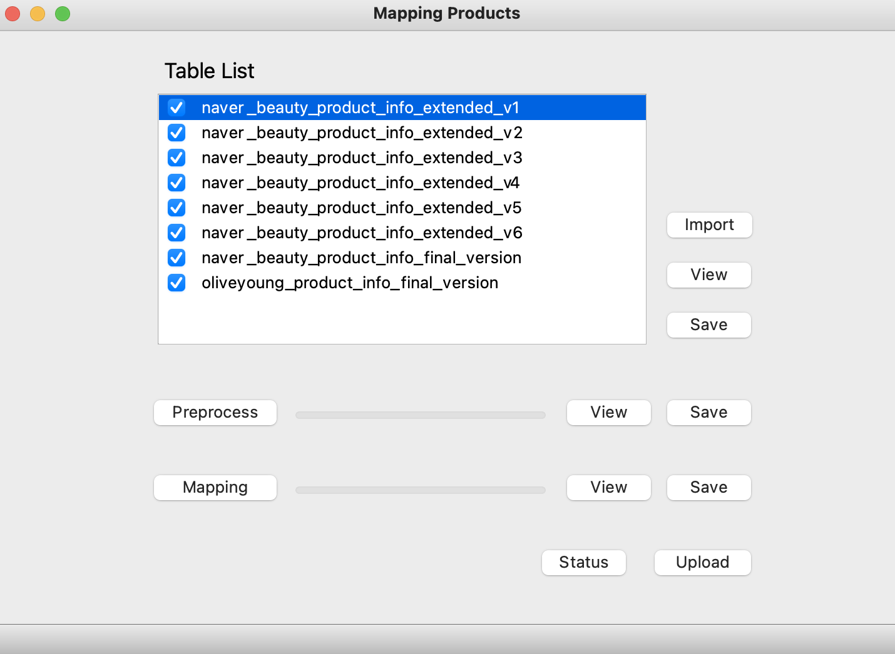
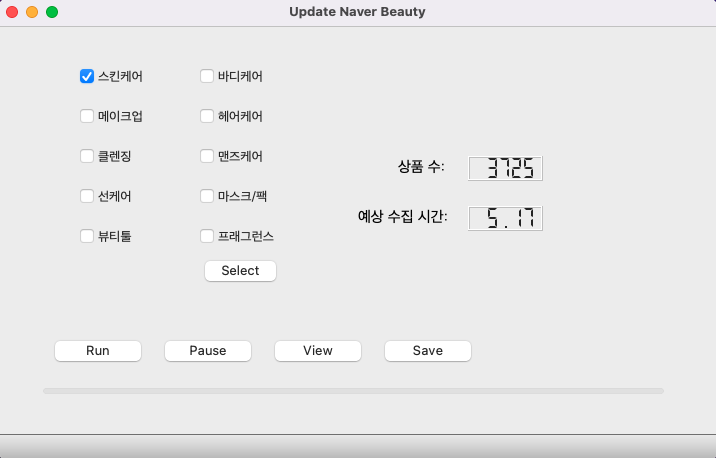
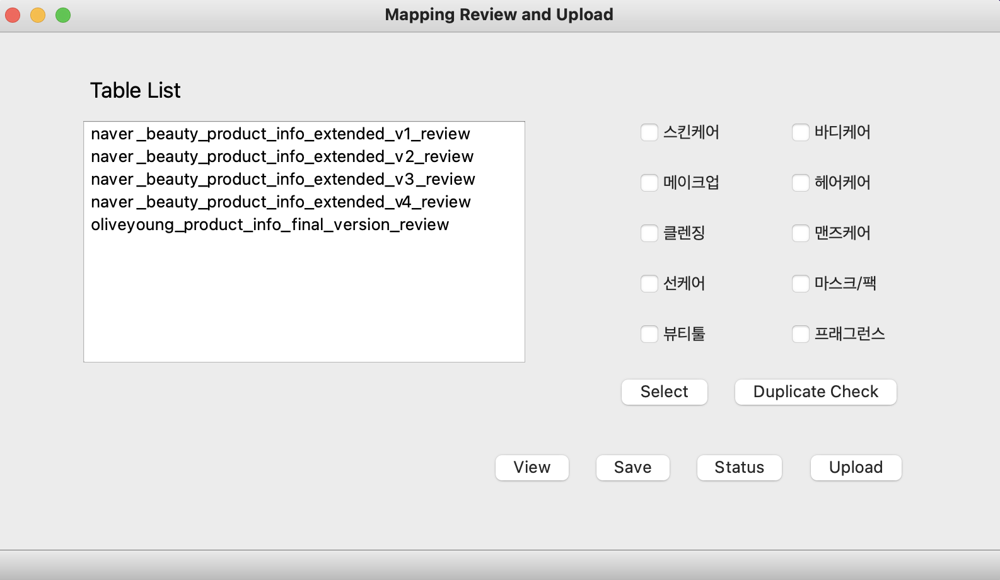
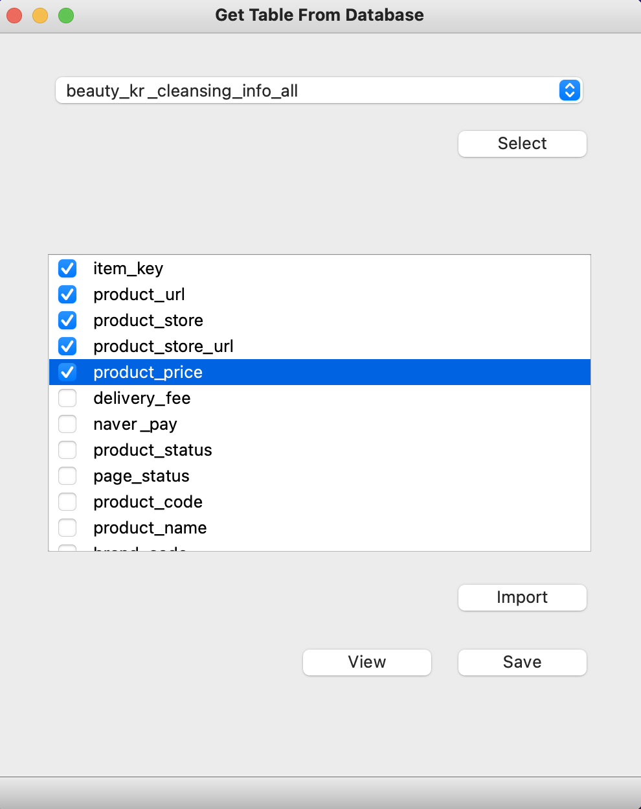

# DataManager

---

** 실행방법: 아이콘 우클릭 후 터미널로 실행하기 ** 

---

## Data Dashboard

### beauty kr 전체 개체 및 리뷰 데이터 분석과 시각화가 구현 된 gui

---

## Connect Database

### 데이터 베이스 연동을 위한 로그인 화면 & 메뉴 선택

**→ user name, password, database 입력 (db로그인 정보와 동일함)**

**→  작업 메뉴 선택** 

**→ Connect 버튼 클릭**

---

## Glowpick Update

### 글로우픽 신규 상품 개체 & 리뷰 업데이트

→ 업데이트 할 카테고리 선택 (전체 카테고리 선택 시 All Categories 체크) 후 Select

→ 신규 상품코드 수집 (Run)

→ 신규 상품 개체 & 리뷰 수집 (Run)

→ 수집과 동시에 db 테이블 형식에 맞게 전처리 후 자동 업로드 진행됩니다.

→ Table

- glowpick_product_info_final_version
- glowpick_product_info_final_version_review

** db연결 끊김 메시지 박스가 뜰 경우 Upload버튼 클릭 ** 

---

## Oliveyoung Update

### 올리브영 신규 상품 개체 & 리뷰 업데이트

→ 업데이트 할 카테고리 선택 (전체 카테고리 선택 시 All Categories 체크) 후 Select

→ 신규 상품코드 수집 (Run)

→ 신규 상품 개체 & 리뷰 수집 (Run)

→ 수집과 동시에 db 테이블 형식에 맞게 전처리 후 자동 업로드 진행됩니다.

→ Table

- oliveyoung_product_info_final_version
- oliveyoung_product_info_final_version_review

** db연결 끊김 메시지 박스가 뜰 경우 Upload 버튼 클릭 ** 

---

## Update Naver Products Sales Status

### 네이버 매핑 상품 판매 현황 업데이트 및 개체 테이블 업로드

→ 카테고리 선택 (한개만 선택 가능) 후 Select 

→ Run, 수집과 동시에 db테이블 형식에 맞게 전처리 후 자동 업로드 진행됩니다.

→ Table

- beauty_kr_{category}_info_all : 카테고리별 매핑 상품 개체 테이블

** db연결 끊김 메시지 박스가 뜰 경우 Upload 버튼 클릭 ** 

---

## Mapping Products

### 상품 매핑 프로세스 메뉴

→ **Table List에서 매핑 대상 테이블 선택 (체크)** 

**→ Import 버튼 클릭 (db에서 테이블 가져오기)** 

**→ View 버튼 :  테이블 보기 (table viewer)** 

**→ Save 버튼 : 테이블 다른이름으로 저장 (.csv)**

**→ Preprocess :  상품명 전처리, 카테고리 재분류**  

**→ Mapping :  매핑 기준에 따라 매핑테이블 생성** 

**→ Status :  매핑 현황 보기** 

**→ Upload :  db에 매핑 테이블 업로드**

---

## Update Naver

### 미매핑 상품 수집 (naver)

→ 업데이트 할 카테고리 선택 후 Select

→ Run: 글로우픽 기준 미매핑 상품 수집

---

## Update Review Table

### 매핑 상품에 대한 리뷰 테이블 업데이트

→ 카테고리 선택 (한개만 선택 가능) 후 Select 

→ Duplicate Check: 리뷰 중복 제거 

→ 매핑 상품 추출 및 리뷰 테이블 전처리 후 업로드 진행 

---

## Get Table From Database

### db에서 원하는 테이블, 원하는 컬럼 가져오기

**→ 테이블 선택 → Select 버튼 클릭**

**→ 컬럼 선택 (체크) → Import 버튼 클릭** 

**→ View 버튼 :  테이블 보기 (table viewer)**

**→ Save 버튼 : 테이블 다른이름으로 저장 (.csv)**

---

## **** 주의사항 ****

- 각 사이트별로 html구조가 변경된다면 수집 코드 변경이 필요할 수 있습니다.
- selenium 버전 업데이트로 인해 기존 코드 실행에서 에러가 발생할 수 있습니다.
    - selenium 4.x.x부터 find_element_by_tag_name(’tag_name’) 에러발생
        
        sol) find_element(By.Tag_NAME, ‘tag_name’)